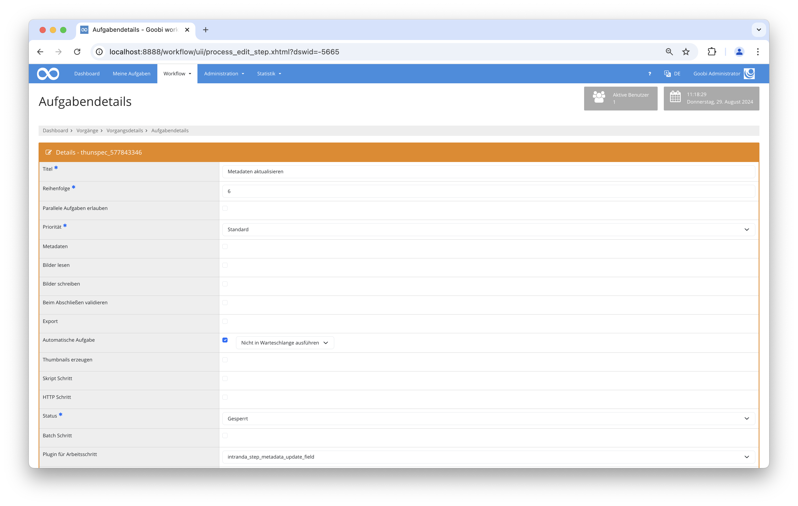

## Einführung
Dieses Plugin für den Goobi workflow ermöglicht es, spezifische Metadatenfelder innerhalb von METS-Dateien automatisch zu erstellen oder zu aktualisieren. Dazu kann es den Variable Replacer oder benachbarte Metadatenfelder verwenden, um Metadaten in logische Elemente auf allen hierarchischen Ebenen zu schreiben.

## Installation
Um das Plugin nutzen zu können, müssen folgende Dateien installiert werden:

```bash
/opt/digiverso/goobi/plugins/step/plugin-step-metadata-update-field-base.jar
/opt/digiverso/goobi/config/plugin_intranda_step_metadata_update_field.xml
```

Nach der Installation des Plugins kann dieses innerhalb des Workflows für die jeweiligen Arbeitsschritte ausgewählt und somit automatisch ausgeführt werden. 

Für die Verwendung des Plugins muss dieses in einem Arbeitsschritt ausgewählt sein:




## Überblick und Funktionsweise
Zuerst müssen die Werte, die das Plugin aktualisieren soll, in der Konfigurationsdatei festgelegt werden. Wenn das Plugin ausgeführt wird, sammelt es alle relevanten Strukturelemente der METS-Datei. Anschließend überprüft es, ob und wie die angegebenen Werte aktualisiert werden sollen. Wenn die Bedingungen erfüllt sind, werden entweder neue Werte in leere Felder eingefügt oder vorhandene Werte überschrieben, falls dies erzwungen wird.

## Konfiguration
Die Konfiguration des Plugins erfolgt in der Datei `plugin_intranda_step_metadata_update_field.xml` wie hier aufgezeigt:

{{CONFIG_CONTENT}}

{{CONFIG_DESCRIPTION_PROJECT_STEP}}

Parameter               | Erläuterung
------------------------|------------------------------------
`<field>`      | Gibt das Feld innerhalb der METS-Datei an, für das der Inhalt generiert werden soll. |
`<element>`    | Bestimmt die Strukturelemente, für die der Inhalt aktualisiert werden soll. Mehrere Elemente können hier aufgelistet werden. Um alle Strukturelementtypen zu berücksichtigen kann `*` verwendet werden. |
`<forceUpdate>`| Gibt an, ob der Inhalt überschrieben werden soll, wenn das Feld nicht leer ist. |
`variable`     | Der Inhalt wird analysiert und durch den Variablenersetzungsprozess ersetzt. |
`metadata`     | Der Wert des Metadatenfeldes mit dem angegebenen Namen innerhalb desselben Strukturelements wird als Inhalt verwendet. |
`static`       | Ein statischer String wird als Inhalt verwendet. |
`random`       | Eine zufällige Zahl mit einer definierten Länge wird als Inhalt verwendet. |
`uuid`         | Eine UUID (Universally Unique Identifier) mit 36 Zeichen wird als Inhalt verwendet. |
`timestamp`    | Ein numerischer Zeitstempel wird als Inhalt verwendet. |
`counter`      | Generiert eine fortlaufende Zahl, die automatisch erhöht wird. Beispielsweise wird mit `%03d` so gezählt: `001`, `002`, `003` etc. |
`groupcounter` | Ein separater Zähler für jeden Wert des Feldes `groupField` wird als Inhalt verwendet. |
`<replace>`    | Erlaubt die Ersetzung von Texten durch andere Texte. |